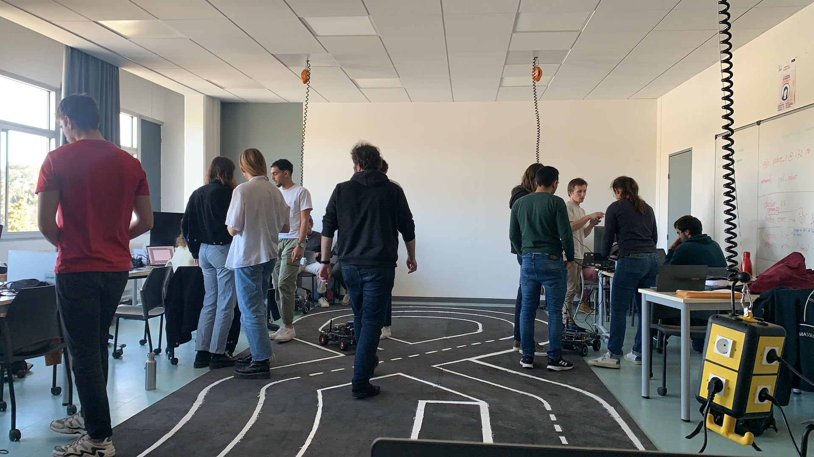

# Hackathon Backup – École Centrale Méditerranée (April 22–27, 2023)

This repository contains a full backup of all materials from the Hackathon held at  
**École Centrale Méditerranée** between **April 22 and 27, 2023**.

The included Python code enables autonomous driving for an **RC vehicle** on a **multi-surface track**.

## Demo

